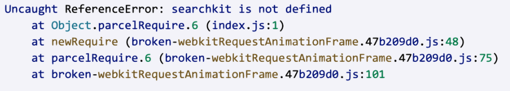

*Question 1*  
 
From: marissa@startup.com  
Subject:  Bad design  

Hello,  
  
Sorry to give you the kind of feedback that I know you do not want to hear, but I really hate the new dashboard design. Clearing and deleting indexes are now several clicks away. I am needing to use these features while iterating, so this is inconvenient.  
   
Thanks,  
Marissa  

---

Hi Marissa,

Thanks for sharing this — I understand how important quick access to those actions is when you’re iterating.

You can still access Clear and Delete with just a couple of clicks:
Go to Search → select your index → Manage Index (top right), and both actions are available in the dropdown.

If you’re using these actions frequently, you may also find the API workflow faster, since it allows you to clear or delete indexes directly from your code without going through the dashboard:
- Clear records: https://www.algolia.com/doc/api-reference/api-methods/clear-objects/
- Delete index: https://www.algolia.com/doc/guides/sending-and-managing-data/manage-indices-and-apps/manage-indices/how-to/delete-indices/

I’ll also pass your feedback to our product team.

Thank you,

Julia

--

*Question 2*:   
  
From: carrie@coffee.com  
Subject: URGENT ISSUE WITH PRODUCTION!!!!  
  
Since today 9:15am we have been seeing a lot of errors on our website. Multiple users have reported that they were unable to publish their feedbacks and that an alert box with "Record is too big, please contact enterprise@algolia.com".  
  
Our website is an imdb like website where users can post reviews of coffee shops online. Along with that we enrich every record with a lot of metadata that is not for search. I am already a paying customer of your service, what else do you need to make your search work?  
  
Please advise on how to fix this. Thanks.   

---

Hi Carrie,

I apologize for the disruption this is causing — let’s get this sorted as quickly as possible.

The “Record is too big” error means some of your records are exceeding the record size limit for your plan — 10KB for Build plans and 100KB for Standard plans and above. Since you mentioned adding metadata that is not used for search, that’s most likely what’s pushing the records over the limit.

The quickest fix is to remove any attributes that are not needed for search before sending records to Algolia, while keeping that data in your own database. Once you re-index the slimmer records, the errors should stop.

If those attributes need to remain attached to the records, we can also look at alternative approaches such as restructuring the data or reviewing whether a higher record size limit makes sense for your use case.

Here’s the documentation on reducing record size:
https://www.algolia.com/doc/guides/sending-and-managing-data/prepare-your-data/how-to/reducing-object-size/

Thank you,  

Julia

*Question 3*:   

From: marc@hotmail.com  
Subject: Error on website  
  
Hi, my website is not working and here's the error:  
  
  
  
Can you fix it please?  

---

Hi Marc,

Thanks for sharing the error — I can help with this.

The error (ReferenceError: searchkit is not defined) typically means Searchkit is being referenced before it’s available in the application, which usually points to how it’s being imported or loaded.

A couple of things to check:
- Ensure Searchkit is properly installed and imported/loaded in the project
- Confirm it’s being included before any code that depends on it runs

Could you confirm how Searchkit is being included in your project (npm import vs script tag/CDN)? That will help me pinpoint the exact issue quickly.

If helpful, I’m happy to jump on a quick call and walk through it with you.

Thank you,

Julia